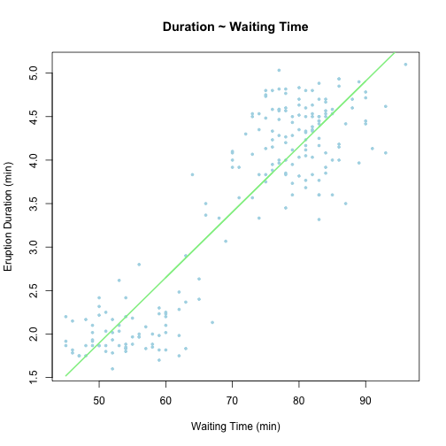

## Introduction

> This is a simple shiny app created for tourists coming to see the wonderful eruption of Old Faithful Geyser in Yellowstone National Park. Time data needed to input into the app is easily to get from information desk of Old Faithful.

## Building Model

> I create a very simple linear regression model to predict the eruption and waiting time alternatively.


```r
library(caret); data(faithful)
inTrain <- createDataPartition(y = faithful$waiting, p = 0.75, list = F)
training <- faithful[inTrain, ]; testing <- faithful[-inTrain, ]
modFit_erupt <- train(eruptions ~ waiting, data = training, method = "lm", 
                     trControl = trainControl(method = "cv"))
```

---

## Model Summary

> Summary information about the model


```
## Linear Regression 
## 
## 206 samples
##   1 predictors
## 
## No pre-processing
## Resampling: Cross-Validated (10 fold) 
## 
## Summary of sample sizes: 185, 185, 186, 186, 185, 186, ... 
## 
## Resampling results
## 
##   RMSE  Rsquared  RMSE SD  Rsquared SD
##   0.5   0.8       0.06     0.05       
## 
## 
```

---

## Visulization of the Model

 

---

## About the shiny app

> By entering Last Eruption Duration in minutes, the app would calculate the possible waiting time. By entering Last Group Waiting Time in minutes, the app would calculate the next possible eruption time. The interactive plot visually represent the model.

> People then would expect how wonderful the Old Faithful they will experience at next eruption and plan for future waiting times.

> You can now test on [shiny_faithful](http://rmarkdown.rstudio.com/authoring_shiny.html).

#### Reference

1. Härdle, W. (1991) Smoothing Techniques with Implementation in S. New York: Springer. 

2. Azzalini, A. and Bowman, A. W. (1990). A look at some data on the Old Faithful geyser. Applied Statistics 39, 357–365. 
